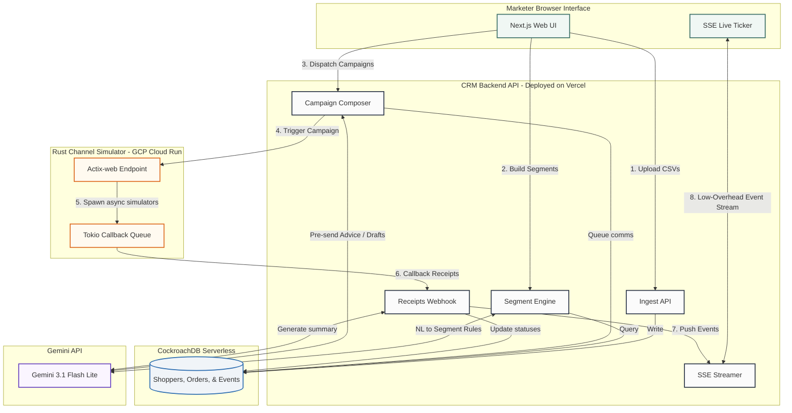

# Technical Architecture Documentation

This document describes the high-level system architecture, data flow, deployment mapping, and key design decisions implemented in **Xeno Mini CRM**.

---

## 1. System Architecture Diagram

This simplified diagram maps the system components, deployment environments, and communication flows. It is structured to show a clean top-to-bottom layout:

---

## 2. Infrastructure & Deployment Topology

To ensure zero-maintenance operations and extreme cost-efficiency for a retail brand, the product utilizes a fully serverless hosting architecture:

* **Frontend & API Gateway (Next.js)**: Deployed on **Vercel**
  - Next.js API routes run on serverless functions that spin up on-demand to process shopper data ingestion, campaign compose actions, and webhook callbacks.
  - Assets and pages are globally optimized at Vercel's Edge CDN.

* **Stubbed Channel Service (Rust)**: Deployed on **GCP Cloud Run**
  - The simulator is packaged as a multi-stage Docker container (alpine base).
  - Cloud Run scales the container instances from zero based on traffic. This handles massive concurrent delivery callback tasks (Tokio threads) cost-effectively and scales back down to zero when idle.

* **Database (CockroachDB)**: Deployed on **CockroachDB Serverless**
  - Provides a globally distributed, PostgreSQL-compatible SQL database.
  - Features scale-to-zero compute pricing with connection pooling support.

---

## 3. Key Architectural Decisions & Reasoning

### 3.1 Decoupled Next.js + Rust Simulator
* **Decision**: Kept the CRM and the Channel Simulator as completely separate, independent services.
* **Reasoning**: Real messaging providers (e.g., Twilio, Gupshup) are third-party services accessed over HTTP. Separating the simulator mimics this real-world constraint. We used **Rust (Actix-web + Tokio)** because its lightweight async task scheduling is perfect for handling concurrent callback simulations without blocking CRM resources.

### 3.2 Server-Sent Events (SSE) for Live Ticker
* **Decision**: Chose SSE over WebSockets for streaming webhook updates to the frontend dashboard.
* **Reasoning**: SSE is unidirectional (server-to-client), operates directly over standard HTTP/1.1 (and HTTP/2), is natively supported by browsers via `EventSource`, and easily deploys on serverless platforms (like Vercel) without requiring a persistent socket infrastructure.

### 3.3 Parameterized direct CockroachDB connections
* **Decision**: Utilized the `pg` connection pool with raw SQL parameters instead of an ORM (like Prisma or Drizzle).
* **Reasoning**: Raw SQL enables precise control over execution plans and query performance on distributed CockroachDB clusters. Parameterization (`$1, $2`) prevents SQL injection attacks, and compiling segment JSON rules directly to parameterized WHERE clauses makes the engine extremely secure.

### 3.4 Time-based 72-Hour Conversion Attribution
* **Decision**: Calculated campaign order conversions using a 3-day sliding window join.
* **Reasoning**: Real marketing platforms do not have explicit foreign keys on orders back to campaigns. We join the tables dynamically: if a shopper places an order within 72 hours of receiving a campaign communication, the CRM attributes the revenue to that campaign. This provides accurate attribution metrics without adding schema complexities.

### 3.5 Webhook Callback Deduplication (Thundering Herd Protection)
* **Decision**:
  1. Rust uses a **Tokio Semaphore** to cap concurrent callbacks (configured to max 50).
  2. CRM uses `WHERE NOT EXISTS` inserts and query-level `DISTINCT ON` CTEs to filter duplicates.
* **Reasoning**: Dispatches targeting 50k+ shoppers fire callbacks simultaneously. Throttling at the simulator prevents exhausting database connection pools. De-duplication on the CRM side guarantees that even if network timeouts trigger simulator HTTP retries, the campaign statistics and Replay playback loops remain perfectly accurate.
